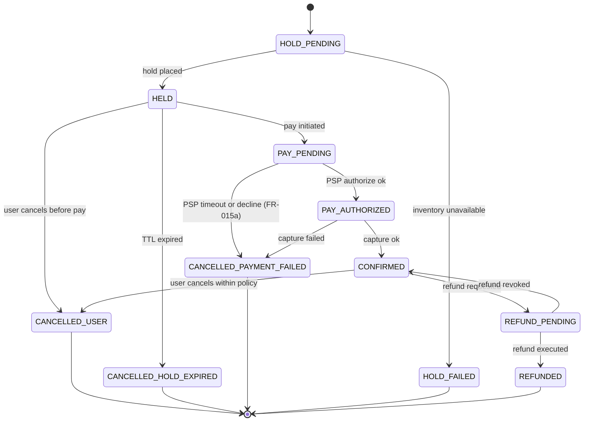
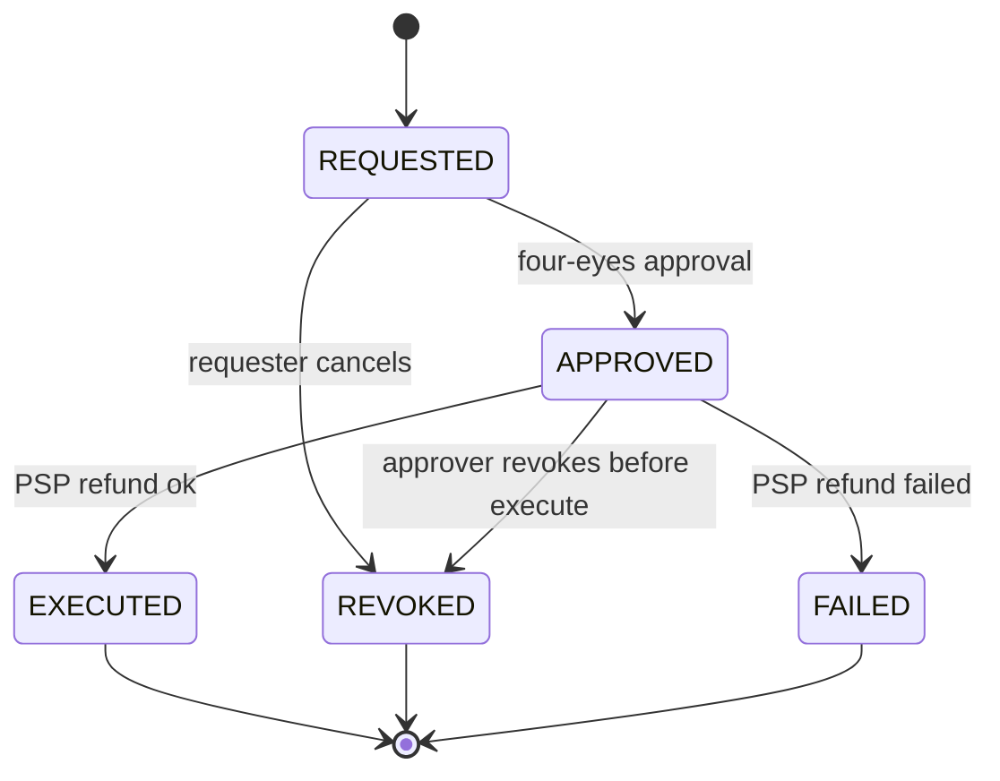
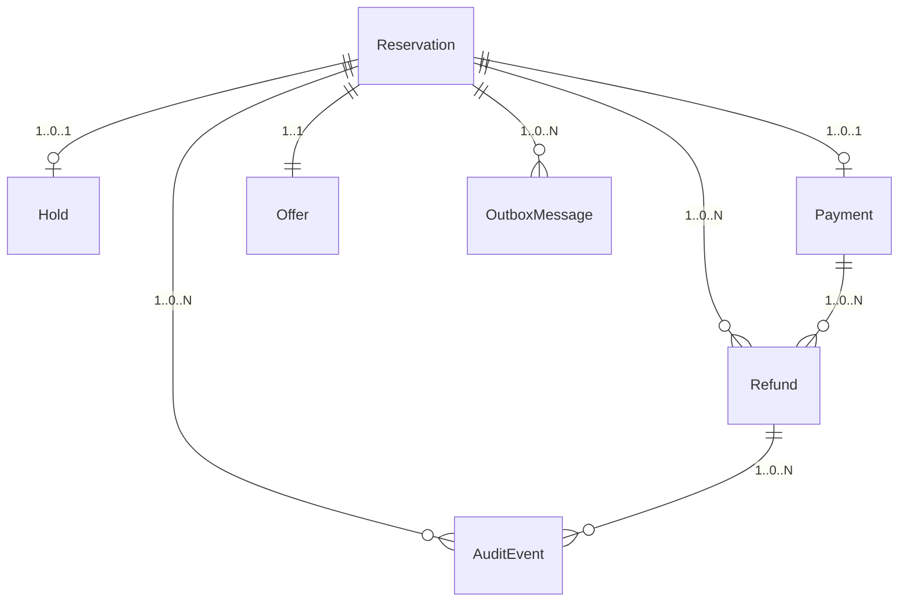

# Phase 1 — Data Model

**Feature**: Reservation & Booking Orchestrator
**Branch**: `001-reservation-orchestrator`
**Date**: 2026-09-01

All entities live in `src/domain/entities/` as plain Python dataclasses / Pydantic
models — free of ORM concerns. `src/adapters/persistence/models/` provides SQLAlchemy
mappings.

Conventions:

- All IDs are ULIDs unless noted; stored as `TEXT` in SQLite.
- All money is `decimal.Decimal` + explicit ISO-4217 `currency` (`USD` only for v1).
- All timestamps are timezone-aware UTC (`TEXT` ISO-8601 in SQLite via SQLAlchemy).
- Every mutable entity carries a monotonic `version` column for optimistic concurrency.

---

## 1. `SearchQuery`

Ephemeral, cache-key only (not persisted long-term).

| Field | Type | Notes |
|---|---|---|
| `query_id` | `str` (ULID) | Correlates search → offer → hold |
| `product_kind` | `enum{FLIGHT, ROOM, BUNDLE}` | Bundle = both |
| `origin` | `str?` | IATA (flight) or null |
| `destination` | `str?` | IATA (flight) or property region code |
| `property_id` | `str?` | For ROOM/BUNDLE |
| `start_at` | `datetime` | UTC |
| `end_at` | `datetime` | UTC |
| `pax` | `int` | ≥ 1 |
| `loyalty_tier` | `enum{NONE, SILVER, GOLD, PLATINUM}` | |
| `currency` | `str` | `USD` in v1 |

**Invariants**: `end_at > start_at`; `pax ≥ 1`. Cached in Redis under
`search:{hash(query_id, canonicalized inputs)}` with TTL 60 s.

## 2. `Offer`

Persisted for the lifetime of any reservation that references it; otherwise TTL 15 min.

| Field | Type | Notes |
|---|---|---|
| `offer_id` | `str` (ULID) | |
| `query_id` | `str` | FK-ish; not enforced |
| `product_kind` | `enum{FLIGHT, ROOM, BUNDLE}` | |
| `provider_ref` | `str` | Provider-side identifier |
| `base_price` | `Money` | |
| `total_price` | `Money` | After all pricing rules |
| `rule_trace` | `list[RuleApplication]` | Ordered; each `{rule_id, delta, reason}` |
| `expires_at` | `datetime` | ≤ 15 min from creation |
| `created_at` | `datetime` | |

**Invariants**: `total_price = base_price + Σ rule_trace.delta`; both non-negative; same
`currency`.

## 3. `Reservation` — root aggregate

| Field | Type | Notes |
|---|---|---|
| `reservation_id` | `str` (ULID) | |
| `user_sub` | `str` | OIDC subject of the buyer |
| `offer_id` | `str` | |
| `state` | `enum` (see SM below) | |
| `hold_id` | `str?` | FK to `Hold` while active |
| `payment_id` | `str?` | FK to `Payment` after auth |
| `total_price` | `Money` | Snapshot from Offer at hold time |
| `correlation_id` | `str` | For observability |
| `created_at` | `datetime` | |
| `updated_at` | `datetime` | |
| `version` | `int` | Optimistic concurrency |

### Reservation state machine

**Invariants**:

- `state` transitions only via `ReservationSM.transition(event)`; forbidden edges raise
  `IllegalStateTransition`.
- `CANCELLED_PAYMENT_FAILED` is terminal.
- Only `CONFIRMED` may enter `REFUND_PENDING`; only `REFUND_PENDING` may return to
  `CONFIRMED` via revoke.

## 4. `Hold`

| Field | Type | Notes |
|---|---|---|
| `hold_id` | `str` (ULID) | |
| `reservation_id` | `str` | FK |
| `offer_id` | `str` | FK |
| `provider_hold_ref` | `str` | Provider-side reservation reference |
| `expires_at` | `datetime` | UTC; = created_at + 15 min |
| `status` | `enum{ACTIVE, RELEASED_USED, RELEASED_EXPIRED, RELEASED_CANCELLED}` | |
| `created_at` | `datetime` | |

**Invariants**: A `Reservation` in `HELD` has exactly one `ACTIVE` `Hold`. Release is
idempotent by `hold_id`.

## 5. `Payment`

| Field | Type | Notes |
|---|---|---|
| `payment_id` | `str` (ULID) | |
| `reservation_id` | `str` | FK |
| `amount` | `Money` | |
| `state` | `enum{PENDING, AUTHORIZED, CAPTURED, FAILED, VOIDED}` | |
| `psp_auth_ref` | `str?` | |
| `psp_capture_ref` | `str?` | |
| `failure_reason` | `str?` | |
| `created_at` | `datetime` | |
| `updated_at` | `datetime` | |

**Invariants**: `AUTHORIZED → CAPTURED` requires `psp_auth_ref`; `VOIDED` only from
`AUTHORIZED`. `state` transitions serialized via the single-writer path.

## 6. `Refund`

**Server-computed fields (FR-018)**: `amount` and `policy_code` are **not**
supplied by the caller — the domain computes them from `RoomCancellationPolicy`
(FR-018a) or `FlightRefundPolicy` (FR-018b) at request time. The
`POST /reservations/{id}/refunds` payload accepts only a free-text `reason`
used as audit justification.

| Field | Type | Notes |
|---|---|---|
| `refund_id` | `str` (ULID) | |
| `reservation_id` | `str` | FK |
| `payment_id` | `str` | FK |
| `amount` | `Money` | ≤ Payment.amount |
| `state` | `enum{REQUESTED, APPROVED, EXECUTED, REVOKED, FAILED}` | |
| `policy_code` | `enum{ROOM_48H_FULL, ROOM_48H_ZERO, FLIGHT_PROVIDER_TERMS, DISCRETIONARY}` | Ties to FR-018a/FR-018b |
| `requested_by_sub` | `str` | OIDC subject |
| `approved_by_sub` | `str?` | Must differ from `requested_by_sub` |
| `psp_refund_ref` | `str?` | Set on EXECUTED |
| `failure_reason` | `str?` | |
| `requested_at` | `datetime` | |
| `approved_at` | `datetime?` | |
| `executed_at` | `datetime?` | |

### Refund state machine

**Invariants (Principle VI)**:

- `REQUESTED → APPROVED` requires `approved_by_sub != requested_by_sub` and both must
  present the `payments:refund:approve` scope.
- The payment adapter re-verifies `state == APPROVED` inside the same DB transaction that
  reserves the outbox event; otherwise it fails-closed.
- Immutable `AuditEvent` recorded on every state transition.
- 100% line + branch coverage required (`pytest -m refund_gate`).
- Auto-refund allowlist ships **empty**; any auto-execution path must fail unless the
  reservation matches an allowlisted rule (there are none at launch).

## 7. `AuditEvent` (append-only)

| Field | Type | Notes |
|---|---|---|
| `event_id` | `str` (ULID) | |
| `aggregate_type` | `enum{RESERVATION, REFUND, PAYMENT, HOLD}` | |
| `aggregate_id` | `str` | |
| `actor_sub` | `str?` | Null for system actions |
| `action` | `str` | Verb, e.g., `refund.approved` |
| `payload_json` | `str` | Redacted per constitution §S-2 |
| `correlation_id` | `str` | |
| `occurred_at` | `datetime` | |

**Invariants**: Append-only; no UPDATE / DELETE grants at the DB user level.

## 8. `IdempotencyRecord`

| Field | Type | Notes |
|---|---|---|
| `key` | `str` (PK) | Header value |
| `request_hash` | `str` | SHA-256 of canonicalized request |
| `response_status` | `int` | |
| `response_body_json` | `str` | |
| `created_at` | `datetime` | |
| `expires_at` | `datetime` | +24 h |

**Invariants**: Middleware replays the stored response if `request_hash` matches;
otherwise returns `409 Conflict`.

## 9. `OutboxMessage`

| Field | Type | Notes |
|---|---|---|
| `message_id` | `str` (ULID, PK) | Also used as event `event_id` downstream |
| `aggregate_type` | `str` | |
| `aggregate_id` | `str` | |
| `event_type` | `str` | e.g., `booking.confirmed` |
| `payload_json` | `str` | Domain event body |
| `correlation_id` | `str` | |
| `traceparent` | `str` | W3C context |
| `created_at` | `datetime` | |
| `published_at` | `datetime?` | Null until publisher succeeds |
| `attempts` | `int` | Retry counter |
| `next_attempt_at` | `datetime` | For exponential backoff |

**Invariants**: Written in the **same transaction** as the aggregate mutation. Publisher
respects insertion order per `aggregate_id` (via `ORDER BY message_id`).

## 10. `PricingRule`

| Field | Type | Notes |
|---|---|---|
| `rule_id` | `str` (PK) | Stable identifier |
| `kind` | `enum{BASE, SEASONAL, SURGE, LOS, LOYALTY_TIER}` | |
| `parameters_json` | `str` | Rule-specific config |
| `enabled` | `bool` | |
| `effective_from` | `datetime` | |
| `effective_to` | `datetime?` | |

**Invariants**: Deterministic pipeline order (`BASE → SEASONAL → SURGE → LOS →
LOYALTY_TIER`). Tie-broken by `rule_id`.

---

## Cross-aggregate relationships

Foreign keys are enforced (`PRAGMA foreign_keys=ON`); `ON DELETE RESTRICT` on all
relationships (soft-cancel via state, never delete history).
